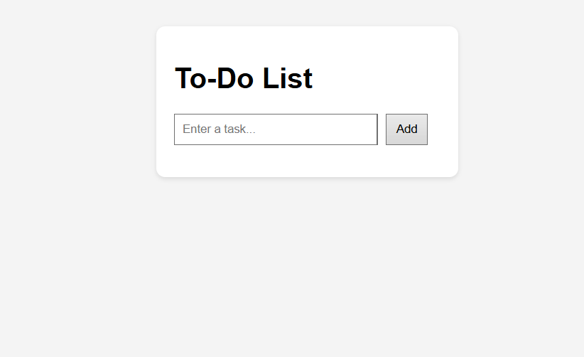

# To-Do List App

A simple and clean To-Do List application built using **HTML**, **CSS**, and **JavaScript**.

## 🔗 Live Demo

👉 [Try the App](https://abderrahmen-todo.netlify.app)

## 📸 Preview

## ✅ Features

- Add new tasks
- Mark tasks as completed
- Remove tasks
- (Optional) Save tasks using local storage (coming soon)

## 🛠 Tech Stack

- HTML5  
- CSS3  
- Vanilla JavaScript  
- Git & GitHub  
- Netlify for hosting

## 📬 Contact

📧 abderahmennsira@gmail.com  
💼 [GitHub](https://github.com/abdou-nsira)
